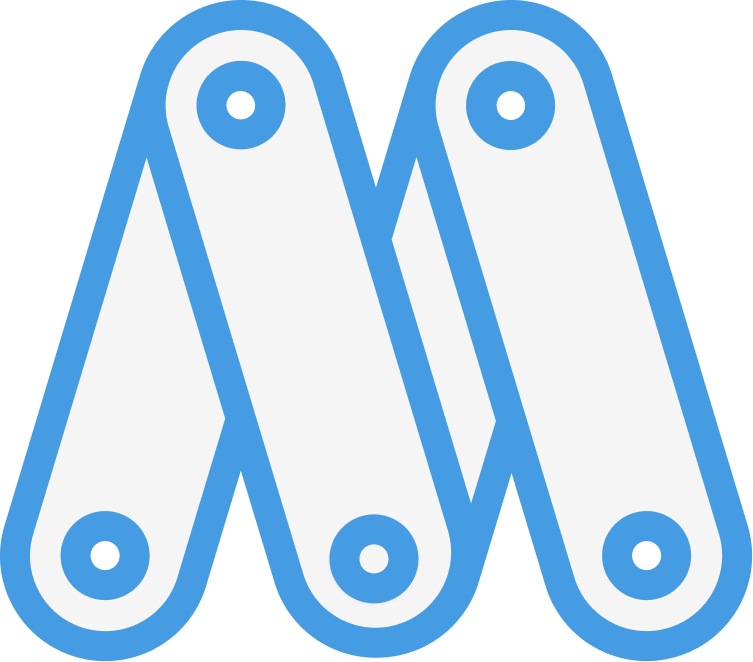

# Mirus

README WIP. Mirus is a complete hobby operating system project, written in C,
Rust, and Assembly. It is not intended to be a production operating system,
but rather a learning experience and a fun project to work on.

## Design goals

Mirus takes inspiration from a variety of operating systems, notably
beOS/Haiku, Windows NT, and Plan 9 from Bell Labs. Some of the key design goals
of Mirus are:

- **Elegant** test bed for new ideas and concepts. Mirus isn't intended to be
a standard POSIX-compliant operating system. While this comes at the expense of
compatibility, it allows for more experimentation and innovation.
- **Secure** by design. Mirus is designed with security in mind, and aims to
provide a secure environment for running applications through the use of sandboxing, capabilities, and other security features.
- **Modern** architecture and feature set. Mirusi s 64-bit native, uses UEFI to boot, and has a system architecture inspired by modern operating systems.
- **Independent** of existing operating systems. Mirus is not based on any existing operating system, and is written from scratch. This extends to as much of the related tooling, userspace, drivers, and libraries as possible.

For more information on the design goals of Mirus, see `docs/design-goals.md`.

## Components

- [`kernel`](./src/kernel/README.md) a 64-bit hybrid kernel written in C and Assembly.
- [`hal`](./src/hal/README.md) - the hardware abstraction layer for Mirus providing a common interface for hardware devices.
- [`libs`](./src/libs/README.md) - a collection of libraries for use in Mirus kernel and userspace.

## Building

To build Mirus, you will need to install all needed dependencies. You can use the `scripts/install-deps.sh` scripts to install dependencies on your platform.

Once the dependencies are installed, you can use `xmake` to build the kernel.

### Bootable disk image

For building a bootable disk image to play with, you will want to build the
`make-iso` recipe.

```sh
$ xmake make-iso
```

### Run in QEMU

You can use QEMU to run the disk image in a virtual machine with UEFI firmware.

```sh
$ xmake run-qemu-uefi
```

### Building for development

See the `docs/building.md` file for more information on building Mirus for development. (TODO: not great for monorepo, where will this file go?)

## License

This project is licensed under the terms of the MIT license.
